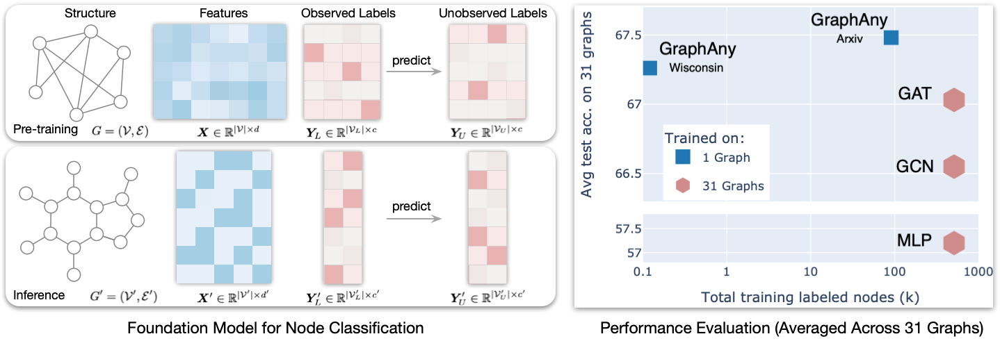

<div align="center">

# GraphAny: A Foundation Model for Node Classification on Any Graph #

[](https://pytorch.org/get-started/locally/)
[](https://pytorchlightning.ai/)
[](https://pytorch-geometric.readthedocs.io/en/latest/install/installation.html)
[](http://arxiv.org/abs/2405.20445)
[](https://hydra.cc/)


</div>

Original PyTorch implementation of [GraphAny].

Authored by [Jianan Zhao], [Hesham Mostafa], [Mikhail Galkin], [Michael Bronstein],
[Zhaocheng Zhu], and [Jian Tang].

[Jianan Zhao]: https://andyjzhao.github.io/
[Hesham Mostafa]: https://www.linkedin.com/in/hesham-mostafa-79ba93237
[Zhaocheng Zhu]: https://kiddozhu.github.io
[Mikhail Galkin]: https://migalkin.github.io/
[Michael Bronstein]: https://www.cs.ox.ac.uk/people/michael.bronstein/
[Jian Tang]: https://jian-tang.com/
[GraphAny]: http://arxiv.org/abs/2405.20445

## Overview ##



GraphAny is a foundation model for node classification. A single pre-trained GraphAny
model performs node classification tasks on any graph with any feature and label
spaces. Performance-wise, averaged on 30+ graphs, a single pre-trained GraphAny model
is better **_in inference mode_** than many supervised models (e.g., MLP, GCN, GAT)
trained specifically for each graph. Following the pretrain-inference paradigm of
foundation models, you can perform training from scratch and inference on 30 datasets
as shown in [Training from scratch](#training-foundation-models-from-scratch-).

This repository is based on PyTorch 2.1, Pytorch-Lightning 2.2, PyG 2.4, DGL 2.1, and Hydra 1.3.

## Environment Setup ##

Our experiments are designed to run on both GPU and CPU platforms. A GPU with 16 GB
of memory is sufficient to handle all 31 datasets, and we have also tested the setup
on a single CPU (specifically, an M1 MacBook).

To configure your environment, use the following commands based on your setup:

```bash
# For setups with a GPU (requires CUDA 11.8):
conda env create -f environment.yaml
# For setups using a CPU (tested on macOS with M1 chip):
conda env create -f environment_cpu.yaml
```

## File Structure ##

```
├── README.md
├── checkpoints
├── configs
│   ├── data.yaml
│   ├── main.yaml
│   └── model.yaml
├── environment.yaml
├── environment_cpu.yaml
└── graphany
    ├── __init__.py
    ├── data.py
    ├── model.py
    ├── run.py
    └── utils
```

## Reproduce Our Results ##

### Training Foundation Models from Scratch ###

This section would detail how users can train GraphAny on one dataset (Cora,
Wisconsin, Arxiv, or Product) and evaluate on all 31 datasets. You can reproduce
our results via the commands below. The checkpoints of these commands are saved in
the `checkpoints/` folder.

```bash
cd path/to/this/repo
# Reproduce GraphAny-Cora: test_acc= 66.98 for seed 0
python graphany/run.py dataset=CoraXAll total_steps=500 n_hidden=64 n_mlp_layer=1 entropy=2 n_per_label_examples=5
# Reproduce GraphAny-Wisconsin: test_acc= 67.36 for seed 0
python graphany/run.py dataset=WisXAll total_steps=1000 n_hidden=32 n_mlp_layer=2 entropy=1 n_per_label_examples=5
# Reproduce GraphAny-Arxiv: test_acc=67.58 for seed 0
python graphany/run.py dataset=ArxivXAll total_steps=1000 n_hidden=128 n_mlp_layer=2 entropy=1 n_per_label_examples=3
# Reproduce GraphAny-Product: test_acc=67.77 for seed 0
python graphany/run.py dataset=ProdXAll total_steps=1000 n_hidden=128 n_mlp_layer=2 entropy=1 n_per_label_examples=3
```

### Inference Using Pre-trained Checkpoints ###

Once trained, GraphAny enjoys the ability to perform inference on any graph. You
can use our trained checkpoint to run inference on your graph easily. Here, we
showcase an example of loading a GraphAny model trained on Arxiv and perform
inference on Cora and Citeseer.

**Step 1**: Define your custom combined dataset config in the `configs/data.yaml` :

```yaml
# configs/data.yaml
_dataset_lookup:
  # Train on Arxiv, inference on Cora and Citeseer
  CoraCiteInference:
    train: [ Arxiv ]
    eval: [ Cora, Citeseer ]
```

**Step 2** _(optional)_: Define your dataset processing logic in graph_any/data.py. Please go through the [Bring Your Own Dataset](#bring-your-own-dataset-) section.
This step is necessary only if you are not using our pre-processed data. If you
choose to use our provided datasets, you can skip this step and proceed directly to
Step 3.

**Step 3**: Run inference with pre-trained model using command:

```bash
python graphany/run.py prev_ckpt=checkpoints/graph_any_arxiv.pt total_steps=0 dataset=CoraCiteInference
# ind/cora_test_acc 79.4 ind/cite_test_acc 68.4
```


<details>
<summary>Example Output Log</summary>
<pre><code># Training Logs
CRITICAL {
'ind/cora_val_acc': 75.4,             
'ind/cite_val_acc': 70.4,             
'val_acc': 72.9,                      
'trans_val_acc': nan,  # Not applicable as Arxiv is not included in the evaluation set             
'ind_val_acc': 72.9,                  
'heldout_val_acc': 70.4,              
'ind/cora_test_acc': 79.4,            
'ind/cite_test_acc': 68.4,            
'test_acc': 73.9,                     
'trans_test_acc': nan,                
'ind_test_acc': 73.9,                 
'heldout_test_acc': 68.4              
}    
INFO Finished main at 06-01 05:07:49, running time = 2.52s.
</code></pre>

Note: The `trans_test_acc` field is not applicable since Arxiv is not specified in
the evaluation datasets. Additionally, the heldout accuracies are calculated by
excluding datasets specified as transductive in `configs/data.yaml` (default
settings: `_trans_datasets: [Arxiv, Product, Cora, Wisconsin]`). To utilize the heldout
metrics correctly, please adjust these transductive datasets in your configuration
to reflect your specific dataset inductive split settings.
</details>

## Configuration Details ##
We use [Hydra](https://hydra.cc/docs/intro/) to manage the configuration. The
configs are organized in three files under the `configs/` directory:

### `main.yaml` ###
Settings for experiments, including random seed, wandb, path,
hydra, and logging configs. 
 
### `data.yaml` ###
This file contains settings for datasets, including preprocessing specifications,
metadata, and lookup configurations. Here’s an overview of the key elements:

<details>

#### Dataset Preprocessing Options ####
- `preprocess_device: gpu` — Specifies the device for computing propagated features $\boldsymbol{F}$. Set to cpu if your GPU memory is below 32GB.
- `add_self_loop: false` — Specifies whether to add self-loops to the nodes in the
  graph.
- `to_bidirected: true` — If set to true, edges are made bidirectional.
- `n_hops: 2` — Defines the maximum number of hops of message passing. In our
  experiments, besides Linear, we use LinearSGC1, LinearSGC1, LinearHGC1,
  LinearHGC2, which predicts information within 2 hops of message passing.

#### Train and Evaluation Dataset Lookup ####
- The datasets for training and evaluation are dynamically selected based on the
  command-line arguments by looking up from the `_dataset_lookup` configuration
- Example: Using `dataset=CoraXAll` sets `train_datasets` to `[Cora]` and
  `eval_datasets` to all datasets (31 in total).

```yaml
train_datasets: ${oc.select:_dataset_lookup.${dataset}.train,${dataset}}
eval_datasets: ${oc.select:_dataset_lookup.${dataset}.eval,${dataset}}
_dataset_lookup:
- CoraXAll:
  - train: [Cora]
  - eval: ${_all_datasets}
```

Please define your own dataset combinations in `_dataset_lookup` if desired. 

#### Detailed Dataset Configurations ####
The dataset meta-data stores the meta information including the interfaces [DGL],
[PyG], [OGB], [Heterophilous] and their aliases (e.g. `Planetoid.Cora`) to load the
dataset.  The statistics are provided in the comment with a format of 'n_nodes,
n_edges, n_feat_dim, n_labels'. For example:

[DGL]: https://docs.dgl.ai/en/2.0.x/api/python/dgl.data.html#node-prediction-datasets
[PyG]: https://pytorch-geometric.readthedocs.io/en/latest/modules/datasets.html
[OGB]: https://ogb.stanford.edu/docs/nodeprop/
[Heterophilous]: https://arxiv.org/abs/2302.11640

```yaml
_ds_meta_data:
  Arxiv: ogb, ogbn-arxiv # 168,343 1,166,243 100 40
  Cora: pyg, Planetoid.Cora # 2,708 10,556 1,433 7
```
</details>

### `model.yaml` ###
This file contains the settings for models and training.

<details>

GraphAny leverages **_interactions between predictions_** as input features for an
MLP to calculate inductive attention scores. These inputs are termed "**_feature
channels_**" and are defined in the configuration file as `feat_chn`. Subsequently,
the outputs from LinearGNNs, referred to as "**_prediction channels_**", are
combined using inductive attention scores and are defined as `pred_chn` in the
configuration file. The default settings are:

```yaml
feat_chn: X+L1+L2+H1+H2 # X=Linear, L1=LinearSGC1, L2=LinearSGC2, H1=LinearHGC1, H2=LinearHGC2
pred_chn: X+L1+L2 # H1 and H2 channels are masked to enhance convergence speed.
```

It is important to note that the feature channels and prediction channels do not
need to be identical. Empirical observations indicate that masking LinearHGC1 and
LinearHGC2 leads to faster convergence and marginally improved results (results in
Table 2, Figure 1, and Figure 5). Furthermore, for the attention visualizations in
Figure 6, all five channels (`pred_chn=X+L1+L2+H1+H2`) are employed. This
demonstrates GraphAny's capability to learn inductive attention that effectively
identifies critical channels for unseen graphs.

Other model parameters and default values:
```yaml
# The entropy to normalize the distance features (conditional gaussian distribution). The standard deviation of conditional gaussian distribution is dynamically determined via binary search, default to 1
entropy: 1
attn_temp: 5 # The temperature for attention normalization
n_hidden: 128 # The hidden dimension of MLP
n_mlp_layer: 2
```
</details>


## Bring Your Own Dataset ##

<details>
<summary>
We support three major sources of graph dataset interfaces:
<a href="https://docs.dgl.ai/en/2.0.x/api/python/dgl.data.html#node-prediction-datasets">DGL</a>,
<a href="https://pytorch-geometric.readthedocs.io/en/latest/modules/datasets.html">PyG</a>, and
<a href="https://ogb.stanford.edu/docs/nodeprop/">OGB</a>.
If you are interested in adding your own dataset, here's how we integrated the cleaned
Texas dataset processed by <a href="https://arxiv.org/abs/2302.11640">this paper</a>.
<i>The original Texas dataset contains 5 classes, with a class with only one node,
which makes using this class for training and evaluation meaningless.</i>
</summary>

In the example below, we demonstrate how to add a dataset called "Texas" with 4
classes from a new data source termed `heterophilous`.

**Step 1**: Update `configs/data.yaml`:

First, define your dataset's metadata.

```yaml
# configs/data.yaml
_ds_meta_data: # key: dataset name, value: data_source, alias
  Texas: heterophilous, texas_4_classes 
```

The `data_source` is set as 'heterophilous', which is handled differently from other
sources ('pyg', 'dgl', 'ogb').

Additionally, update the `_dataset_lookup` with a new setting:

```yaml
# configs/data.yaml
_dataset_lookup:
  Debug:
    train: [ Wisconsin ]
    eval: [ Texas ]
```

**Step 2**: Implement the dataset interface:

Implement `load_heterophilous_dataset` in `data.py` to download and process the dataset.

```python
import numpy as np
import torch
from graphany.data import download_url
import dgl

def load_heterophilous_dataset(url, raw_dir):
    # Converts Heterophilous dataset to DGL Graph format
    download_path = download_url(url, raw_dir)
    data = np.load(download_path)
    node_features = torch.tensor(data['node_features'])
    labels = torch.tensor(data['node_labels'])
    edges = torch.tensor(data['edges'])

    graph = dgl.graph((edges[:, 0], edges[:, 1]),
                      num_nodes=len(node_features), idtype=torch.int32)
    num_classes = len(labels.unique())
    train_mask, val_mask, test_mask = torch.tensor(data['train_mask']), torch.tensor(data['val_mask']), torch.tensor(
        data['test_mask'])

    return graph, labels, num_classes, node_features, train_mask, val_mask, test_mask
```

**Step 3**: Update `GraphDataset` class in `data.py`:

Modify the initialization and dataset loading functions:

```python
# In GraphDataset.__init__():
if self.data_source in ['dgl', 'pyg', 'ogb']:
    pass # Code for other data sources omitted for brevity
elif self.data_source == 'heterophilous':
    target = '.data.load_heterophilous_dataset'
    url = f'https://example.com/data/{ds_alias}.npz'
    ds_init_args = {
        "_target_": target, 'raw_dir': f'{cfg.dirs.data_storage}{self.data_source}/', 'url': url
    }
else:
    raise NotImplementedError(f'Unsupported data source: {self.data_source}')

# In GraphDataset.load_dataset():
from hydra.utils import instantiate
def load_dataset(self, data_init_args):
    dataset = instantiate(data_init_args)
    if self.data_source in ['dgl', 'pyg', 'ogb']:
        pass # Code for other data sources omitted for brevity
    elif self.data_source == 'heterophilous':
        g, label, num_class, feat, train_mask, val_mask, test_mask = dataset
    # Rest of the code omitted for brevity
```

You can now run the code using the following commands:

```bash
# Training from scratch
python graphany/run.py dataset=Debug total_steps=500
# Inference using existing checkpoint
python graphany/run.py prev_ckpt=checkpoints/graph_any_wisconsin.pt dataset=Debug total_steps=0
```
</details>

## Using Wandb for Enhanced Visualization ##

We recommend using [Weights & Biases](https://wandb.ai/) (wandb) for advanced
visualization capabilities. As an example, consider the visualizations for the
GraphAny-Arxiv project shown below, which illustrate the validation accuracy across
different data set categories:
- **Transductive**: Training dataset (i.e. Arxiv)
- **Heldout**: 27 datasets (except Cora, Wisconsin, Arxiv, Product)
- **Inductive**: 30 datasets (except arxiv)
- **Overall**: 31 datasets (all datasets)


By default, wandb integration is disabled. To enable and configure wandb for your
project, use the following command, substituting `YourOwnWandbEntity` with your
actual Weights & Biases entity name:

```bash
use_wandb=true wandb_proj=GraphAny wandb_entity=YourOwnWandbEntity
```

This setup will allow you to track and visualize metrics dynamically.

## Citation ##
If you find this codebase useful in your research, please cite the paper.

```bibtex
@article{zhao2024graphany,
      title={GraphAny: A Foundation Model for Node Classification on Any Graph}, 
      author={Jianan Zhao and Hesham Mostafa and Mikhail Galkin and Michael Bronstein and Zhaocheng Zhu and Jian Tang},
      year={2024},
      eprint={2405.20445},
      archivePrefix={arXiv},
      primaryClass={cs.LG}
}
```